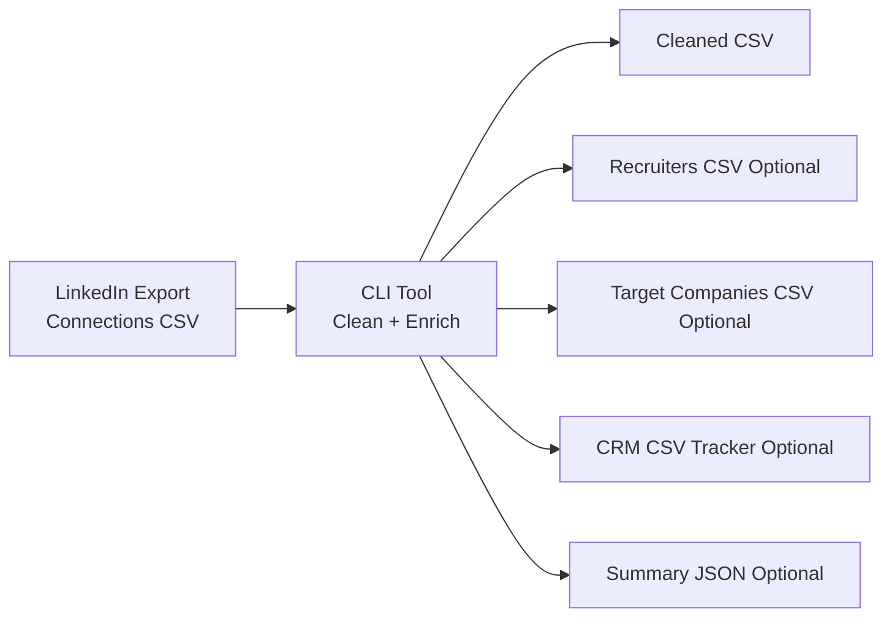
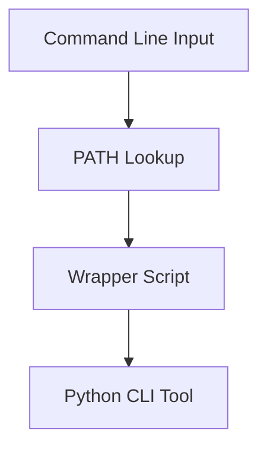

# LinkedIn Connections Toolkit (Windows)

Clean, enrich, and segment LinkedIn’s exported `Connections.csv` for job-search / networking workflows on Windows.

---

## 🚀 What this does

* Removes LinkedIn metadata/junk rows automatically
* Outputs a clean, usable dataset
* Filters recruiters / HR connections
* Extracts target companies
* Generates a CRM-style tracker
* Supports automation + outreach workflows

---

## 🧠 Conceptual Overview



---

## 📁 Project Structure

```
linkedin-connections-toolkit/
│
├── linkedin_connections.py
├── requirements.txt
├── Connections.csv
├── out/
│
└── docs/
    └── images/
        ├── pipeline.png
        ├── windows-path.png
        └── output-clean.png
```

---

## ⚙️ Prerequisites (Windows)

* Python 3.x installed
* PowerShell or CMD

Check installation:

```powershell
python --version
```

---

## 🔧 Setup (PowerShell)

```powershell
python -m venv .venv
Set-ExecutionPolicy -Scope Process -ExecutionPolicy Bypass
.\.venv\Scripts\Activate.ps1

python -m pip install --upgrade pip
pip install -r requirements.txt
```

---

## 🔧 Setup (CMD)

```bat
python -m venv .venv
.\.venv\Scripts\activate.bat

python -m pip install --upgrade pip
pip install -r requirements.txt
```

---

## 📦 requirements.txt

```
pandas>=2.0
openpyxl>=3.1
```

---

## ▶️ Usage

### Basic Clean

```powershell
python linkedin_connections.py ^
  --input "Connections.csv" ^
  --outdir "out" ^
  --export clean
```

---

### Full Workflow (Recommended)

```powershell
python linkedin_connections.py ^
  --input "C:\Users\12242\Documents\Desktop\linkedinConnections\Connections.csv" ^
  --outdir "out" ^
  --export clean ^
  --export recruiters ^
  --export crm ^
  --add-full-name ^
  --add-email-domain ^
  --add-connected-iso ^
  --dedupe

python .\linkedin_connections.py --input "C:\Users\12242\Documents\Desktop\linkedinConnections\Connections.csv" --outdir "out" --export clean --export recruiters --export crm --add-full-name --add-email-domain --add-connected-iso --dedupe

```

---

### Target Companies

```powershell
python linkedin_connections.py ^
  --input "Connections.csv" ^
  --outdir "out" ^
  --export targets ^
  --target-companies "Google,Microsoft,OpenAI,Amazon"
```

---

## ⚡ PowerShell One-Liner (Full Setup + Run)

```powershell
python -m venv .venv; `
Set-ExecutionPolicy -Scope Process -ExecutionPolicy Bypass; `
.\.venv\Scripts\Activate.ps1; `
pip install -U pip; `
pip install pandas openpyxl; `
python linkedin_connections.py --input "C:\Users\12242\Documents\Desktop\linkedinConnections\Connections.csv" --outdir "out" --export clean --export recruiters --export crm --add-full-name --dedupe
```

---

## 🌐 Run From Anywhere (PATH Setup)

### Concept



---

### Step 1 — Create Wrapper

Create: `bin/linkedin-connections.cmd`

```bat
@echo off
set SCRIPT_DIR=%~dp0..
python "%SCRIPT_DIR%\linkedin_connections.py" %*
```

---

### Step 2 — Add to PATH (GUI)

1. Search: **Environment Variables**
2. Click **Edit Path**
3. Add:

```
C:\Users\12242\Documents\Desktop\linkedinConnections\bin
```

4. Restart terminal

---

### Run globally

```powershell
linkedin-connections --input "Connections.csv"
```

---

## 📊 Example Output

### Cleaned CSV

```markdown

```

---

### CRM Tracker Columns

* Full Name
* Company
* Position
* Status
* Last Contacted
* Notes

---

## 🔍 Before vs After

| Raw Export       | Clean Output  |
| ---------------- | ------------- |
| Junk rows        | Clean headers |
| Messy formatting | Normalized    |
| Hard to use      | CRM-ready     |

---

## 🔐 Privacy Notes

* LinkedIn exports may not include all emails
* Do NOT upload your CSV to GitHub
* Use `--redact-emails` for sharing

---

## 💡 Why This Exists

LinkedIn exports are not ready for real workflows.

This tool turns them into:

* Recruiter pipelines
* Target company lists
* Outreach-ready datasets
* Lightweight CRM system

---

## 🚀 Future Enhancements

* AI-generated outreach messages
* LinkedIn job matching
* Streamlit dashboard
* Auto-enrichment (company + domain lookup)

---

## 📜 License

MIT License
